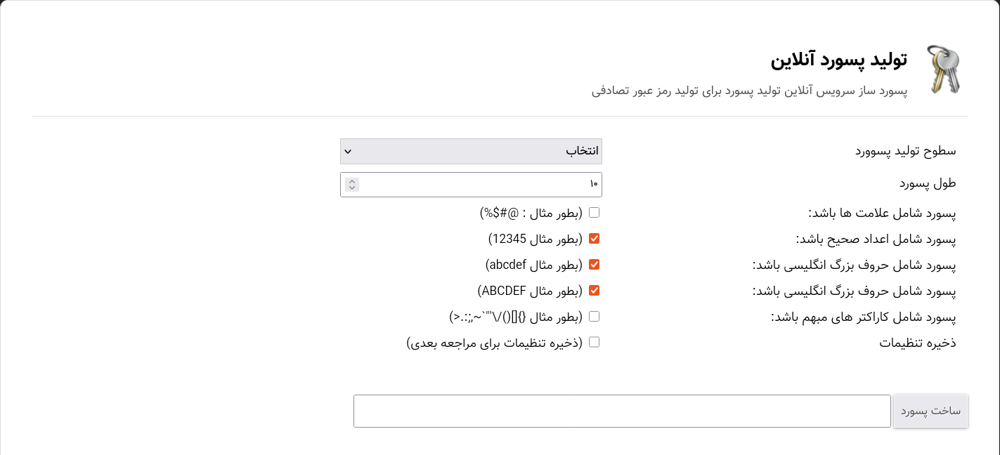

# Secure Password Generator 

A lightweight and customizable tool to generate strong, random passwords. Built with **HTML, CSS, and JavaScript** for simplicity and security.

## Features
- **Customizable passwords**: Adjust length (4-64 characters) and character types:
  - Uppercase (A-Z)
  - Lowercase (a-z)
  - Numbers (0-9)
  - Special symbols (!@#$%^&*)
- **One-click copy**: Instantly copy passwords to clipboard.
- **Responsive design**: Works on desktop and mobile.
- **No dependencies**: Pure vanilla JS.
